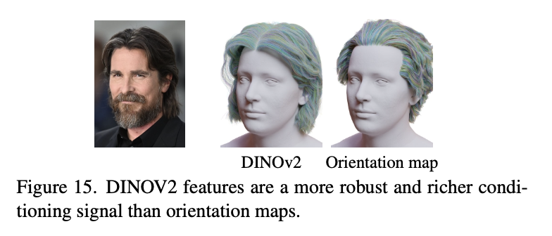
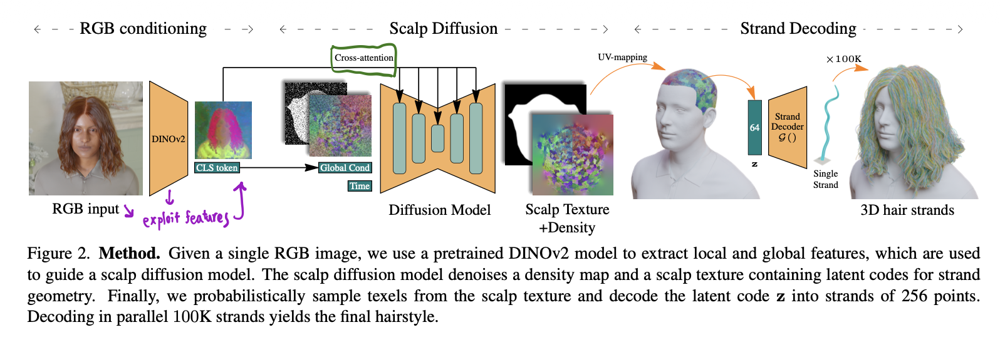
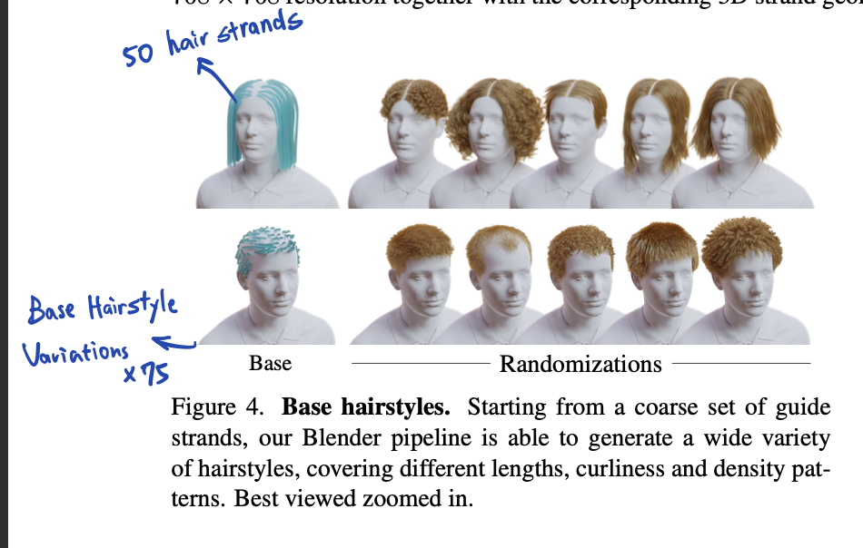
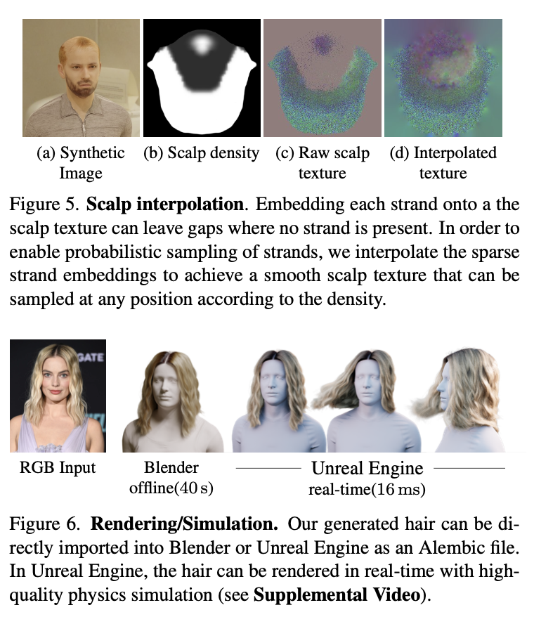
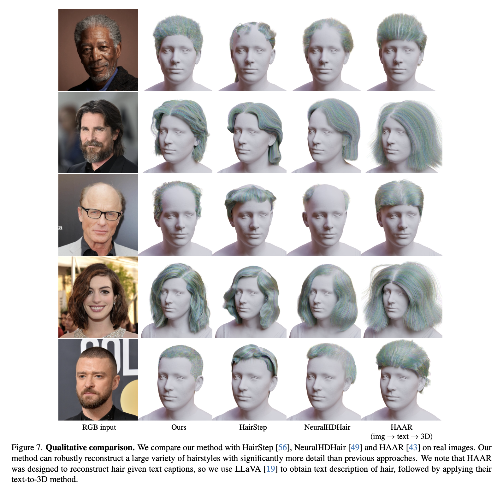
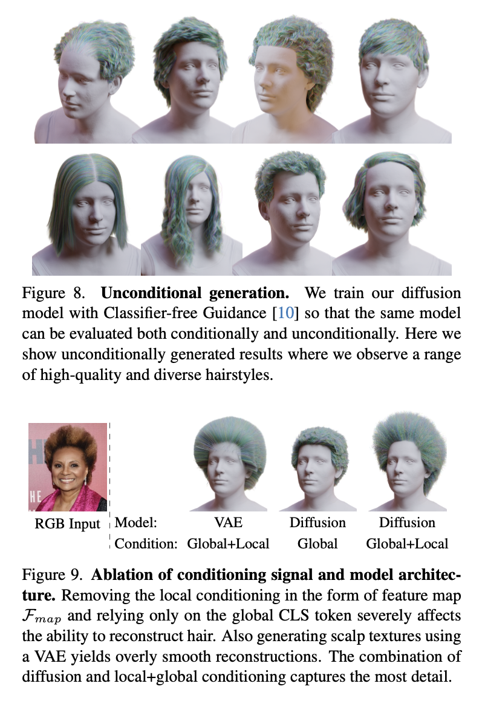
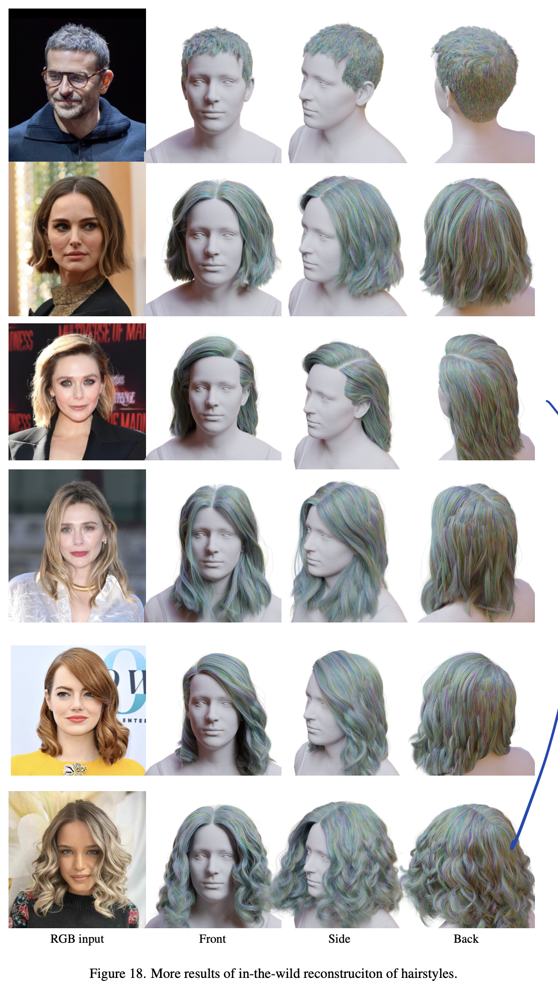

# Contributions of this paper:
1. Presented a 3D synthetic hair dataset consisting of 40K samples covering a wide variety of hairstyles.
    - They designed a large and very general geometry node network in Blender to generate various hairstyles.
2. Trained a novel diffusion framework called DiffLocks:
    - Used Hourglass Diffusion Transformers as a diffusion architecture.
    - Exploited features from a pretrained DINOv2 model.
        - DINOv2 features are richer than oreinted filters.
        
3. Regressed the latent code for individual hair strands instead of guide strands, enabling the transformer to learn detailed spatial relationship between scalp and hair strand.
4. Modeled a desity map that defines the probability of a strand being generated at each location of the scalp.

# Figures

