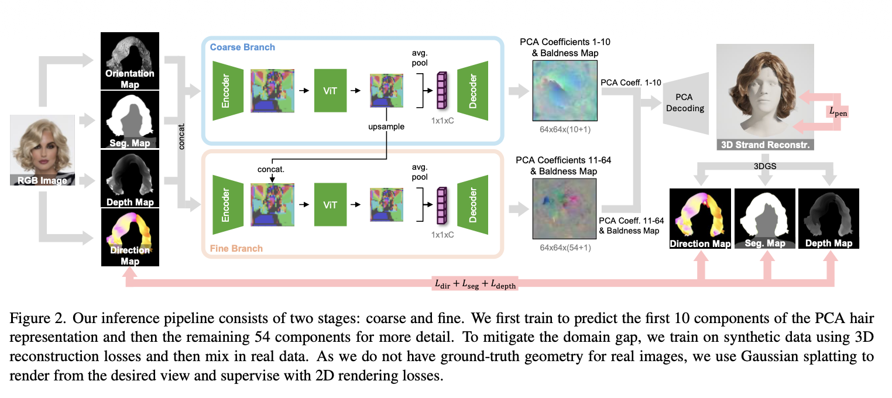
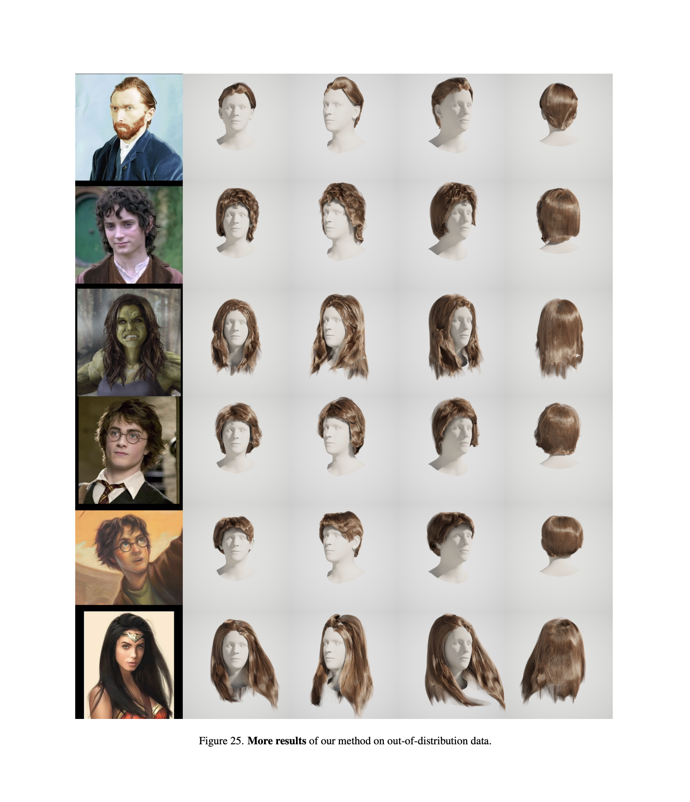

# Novelty of this paper
- Uses both real and synthetic data to learn an effective hairstyle prior.
# Contributions of this paper:
1. Transformer based prior model
    - synthetic data for the internal hairstyle geometry 
    - real data for the outer structure
2. Uses transformer based prior to create a Gaussian-splitting-based reconstruction mehtod.

# Architecture
1. Training the coarse branch considering the synthetic dataset with 3D supervision on the output.
2. Training the fine branch with the same losses.
3. Joint training with additional real data using self-supervised rendering losses.

# Thoughts
## Good parts
1. The concept of training synthetic dataset for inner hair structure and real dataset for outer details.
2. This paper focus on transformner based prior model while DiffLocks focus on diffusion based model.
## Improvements
1. The backside of the hair is too smooth.
2. The hair color looks the same.

